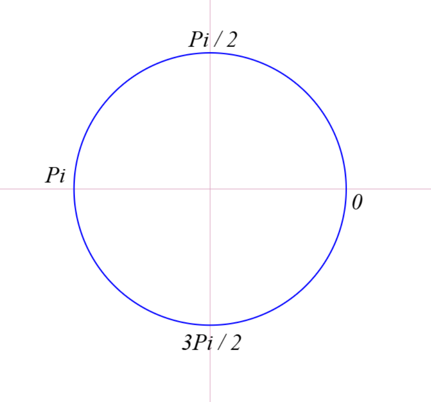
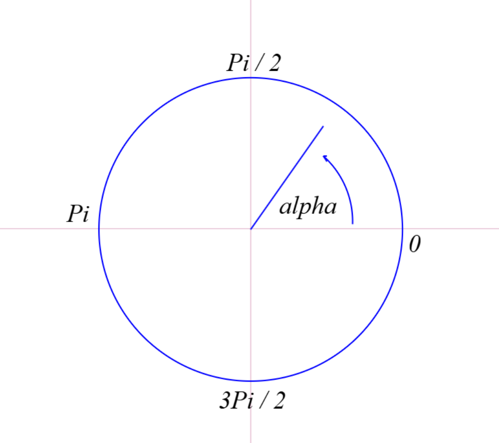
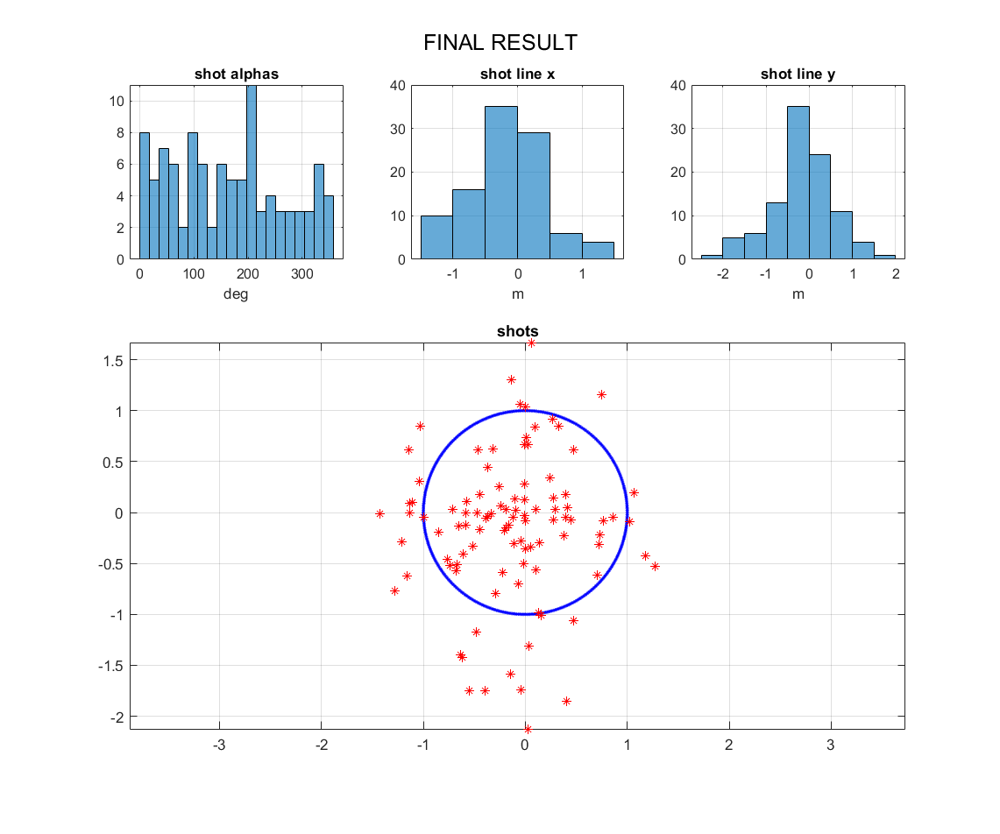

# **Hit Model**


Доделаю позже.........

```
Примитивная модель имитирующая попадания баллистического снаряда в заданную область. Возможно пригодится для чего-то большего, кто значет....
```


## Область попадания (окружность)

Имеем окружность радиусом *R* с центром в точке *O*. 



Зададим угловое смещение



$ a = R * Cos(\alpha) $  
$ a = R * Sin(\alpha) $


Окружность рисуем через угловое смещение с заданным шагом (радианы)




